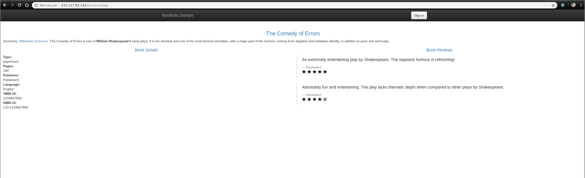

# Securing application communication with knative

# Installing istio

To install istio run the following from the root of the repo that you have cloned

```
./securing-application-communication-with-istio/scripts/istio.sh
```

To view the script click [here](scripts/istio.sh)

The script will install istio using helm and giving us a few more options.
We are going to enable grafana, tracing and [kiali](https://github.com/kiali/kiali)

# Checking istio is installed correctly

Before we move on we want to make sure that istio in installed and running correctly.
We will do that by issuing

`kubectl get svc -n istio-system`

The output should look like
### Azure
```
$ kubectl get svc -n istio-system
NAME                     TYPE           CLUSTER-IP     EXTERNAL-IP    PORT(S)                                                                                                                   AGE
grafana                  ClusterIP      10.0.161.95    <none>         3000/TCP                                                                                                                  1d
istio-citadel            ClusterIP      10.0.4.134     <none>         8060/TCP,9093/TCP                                                                                                         1d
istio-egressgateway      ClusterIP      10.0.185.41    <none>         80/TCP,443/TCP                                                                                                            1d
istio-galley             ClusterIP      10.0.165.249   <none>         443/TCP,9093/TCP                                                                                                          1d
istio-ingressgateway     LoadBalancer   10.0.127.246   40.114.74.87   80:31380/TCP,443:31390/TCP,31400:31400/TCP,15011:31536/TCP,8060:31217/TCP,853:31479/TCP,15030:31209/TCP,15031:31978/TCP   1d
istio-pilot              ClusterIP      10.0.69.62     <none>         15010/TCP,15011/TCP,8080/TCP,9093/TCP                                                                                     1d
istio-policy             ClusterIP      10.0.71.79     <none>         9091/TCP,15004/TCP,9093/TCP                                                                                               1d
istio-sidecar-injector   ClusterIP      10.0.100.95    <none>         443/TCP                                                                                                                   1d
istio-telemetry          ClusterIP      10.0.35.107    <none>         9091/TCP,15004/TCP,9093/TCP,42422/TCP                                                                                     1d
jaeger-agent             ClusterIP      None           <none>         5775/UDP,6831/UDP,6832/UDP                                                                                                1d
jaeger-collector         ClusterIP      10.0.27.14     <none>         14267/TCP,14268/TCP                                                                                                       1d
jaeger-query             ClusterIP      10.0.131.110   <none>         16686/TCP                                                                                                                 1d
kiali                    ClusterIP      10.0.163.94    <none>         20001/TCP                                                                                                                 1d
prometheus               ClusterIP      10.0.158.188   <none>         9090/TCP                                                                                                                  1d
tracing                  ClusterIP      10.0.162.108   <none>         80/TCP                                                                                                                    1d
zipkin                   ClusterIP      10.0.221.151   <none>         9411/TCP                                                                                                                  1d

```

### Minikube
```
$ kubectl get svc -n istio-system
NAME                     TYPE           CLUSTER-IP       EXTERNAL-IP   PORT(S)                                                                                                                   AGE
grafana                  ClusterIP      10.105.190.50    <none>        3000/TCP                                                                                                                  19m
istio-citadel            ClusterIP      10.108.71.131    <none>        8060/TCP,9093/TCP                                                                                                         19m
istio-egressgateway      ClusterIP      10.97.180.125    <none>        80/TCP,443/TCP                                                                                                            19m
istio-galley             ClusterIP      10.110.109.224   <none>        443/TCP,9093/TCP                                                                                                          19m
istio-ingressgateway     LoadBalancer   10.109.197.49    <pending>     80:31380/TCP,443:31390/TCP,31400:31400/TCP,15011:31809/TCP,8060:31143/TCP,853:31762/TCP,15030:31549/TCP,15031:31332/TCP   19m
istio-pilot              ClusterIP      10.107.101.198   <none>        15010/TCP,15011/TCP,8080/TCP,9093/TCP                                                                                     19m
istio-policy             ClusterIP      10.97.27.29      <none>        9091/TCP,15004/TCP,9093/TCP                                                                                               19m
istio-sidecar-injector   ClusterIP      10.111.80.115    <none>        443/TCP                                                                                                                   19m
istio-telemetry          ClusterIP      10.96.180.26     <none>        9091/TCP,15004/TCP,9093/TCP,42422/TCP                                                                                     19m
jaeger-agent             ClusterIP      None             <none>        5775/UDP,6831/UDP,6832/UDP                                                                                                19m
jaeger-collector         ClusterIP      10.111.234.21    <none>        14267/TCP,14268/TCP                                                                                                       19m
jaeger-query             ClusterIP      10.110.117.50    <none>        16686/TCP                                                                                                                 19m
kiali                    ClusterIP      10.107.254.72    <none>        20001/TCP                                                                                                                 19m
prometheus               ClusterIP      10.105.165.152   <none>        9090/TCP                                                                                                                  19m
tracing                  ClusterIP      10.108.162.245   <none>        80/TCP                                                                                                                    19m
zipkin                   ClusterIP      10.103.129.249   <none>        9411/TCP                                                                                                                  19m
```
__NOTE:__ Because we are not using an external load balancer, the EXTERNAL-IP for the `istio-intressgateway` will remain as pending.

and also `kubectl get pods -n istio-system`
and we should see all the pods as running
```
$ kubectl get pods -n istio-system
NAME                                      READY   STATUS    RESTARTS   AGE
grafana-59b787b9b-4k994                   1/1     Running   0          1d
istio-citadel-5d8956cc6-gl7hg             1/1     Running   0          1d
istio-egressgateway-f48fc7fbb-f5bv6       1/1     Running   0          1d
istio-galley-6975b6bd45-mqtsn             1/1     Running   0          1d
istio-ingressgateway-c6c4bcdbf-njpn5      1/1     Running   0          1d
istio-pilot-5b6c9b47d5-qw8b4              2/2     Running   0          1d
istio-policy-6b465cd4bf-xgc7r             2/2     Running   0          1d
istio-sidecar-injector-575597f5cf-8m7c6   1/1     Running   0          1d
istio-telemetry-6944cd768-dppbr           2/2     Running   0          1d
istio-tracing-7596597bd7-vffz6            1/1     Running   0          1d
kiali-5fbd6ffb-6qqfn                      1/1     Running   0          1d
prometheus-76db5fddd5-s7dth               1/1     Running   0          1d
```

We will create a new namespace just for this application. To do that we will use the below command
`kubectl create namespace istio-app`

Once all our pods are up and running we will set istio to automatically inject the side car information to envoy
`kubectl label namespace istio-app istio-injection=enabled`

If you wanted to do that manually with every application deployment you could use this
`istioctl kube-inject -f <your-app-spec>.yaml | kubectl apply -f -`


# Mutual TLS
I think the bear minimum that we need to class an application as secure is mutual TLS through the back end.
The beauty of istio is that it will handle the heavy lifting for you and implement it without having to change your application.
So let's test this out.

We will enable mutual TLS across our `istio-app` namespace

```
cat <<EOF | istioctl create -f -
apiVersion: authentication.istio.io/v1alpha1
kind: Policy
metadata:
  name: default
  namespace: istio-app
spec:
  peers:
  - mtls:
EOF
```

```
cat <<EOF | istioctl create -f -
apiVersion: networking.istio.io/v1alpha3
kind: DestinationRule
metadata:
  name: default
  namespace: istio-app
spec:
  host: "*"
  trafficPolicy:
    tls:
      mode: ISTIO_MUTUAL
EOF
```

# Deploying a service to Kubernetes

We are just going to use the sample application that istio gives us. This is a really good place to start.
Its also freely available so you can use it again in your own free time after this course.

Here is the architecture of the application


We will namespace our application again in the namespace we created earlier called `istio-app`

To deploy the application we will use the files that our install script pulled down for us.
`kubectl create -n istio-app -f istio-1.0.4/samples/bookinfo/platform/kube/bookinfo.yaml`

We can check the state of our services with
`kubectl get services -n istio-app`
We should get something like
```
NAME          TYPE        CLUSTER-IP     EXTERNAL-IP   PORT(S)    AGE
details       ClusterIP   10.0.160.215   <none>        9080/TCP   36s
productpage   ClusterIP   10.0.254.103   <none>        9080/TCP   33s
ratings       ClusterIP   10.0.241.132   <none>        9080/TCP   35s
reviews       ClusterIP   10.0.254.18    <none>        9080/TCP   35s
```

and our pods with
`kubectl get pods -n istio-app`
with an output of
```
NAME                             READY   STATUS    RESTARTS   AGE
details-v1-6764bbc7f7-b9p9j      2/2     Running   0          5m
productpage-v1-54b8b9f55-5k4pq   2/2     Running   0          5m
ratings-v1-7bc85949-mxfp7        2/2     Running   0          5m
reviews-v1-fdbf674bb-plpk9       2/2     Running   0          5m
reviews-v2-5bdc5877d6-9xhvd      2/2     Running   0          5m
reviews-v3-dd846cc78-9fgwj       2/2     Running   0          5m
```
At this point we have all our services up and running but istio is not exposing them to the outside world as we have not defined a virtual service to define how to route our traffic. To do that we can use the below yaml file
```
cat <<EOF | kubectl apply -f -
apiVersion: networking.istio.io/v1alpha3
kind: VirtualService
metadata:
  name: bookinfo
  namespace: istio-app
spec:
  gateways:
  - bookinfo-gateway
  hosts:
  - '*'
  http:
  - match:
    - uri:
        exact: /productpage
    - uri:
        exact: /login
    - uri:
        exact: /logout
    - uri:
        prefix: /api/v1/products
    route:
    - destination:
        host: productpage
        port:
          number: 9080
EOF
```
Now we will attach the virtual service to the default ingress gateway.
```
cat <<EOF | kubectl apply -f -
apiVersion: networking.istio.io/v1alpha3
kind: Gateway
metadata:
  name: bookinfo-gateway
  namespace: istio-app
spec:
  selector:
    istio: ingressgateway # use istio default controller
  servers:
  - port:
      number: 80
      name: http
      protocol: HTTP
    hosts:
    - "*"
EOF
```
Now to test our application is working. Get the correct URL for your environment:

### Azure
Find the IP address of the loadbalancer and assign to the GATEWAY_URL
`export GATEWAY_URL=$(kubectl -n istio-system get service istio-ingressgateway -o jsonpath='{.status.loadBalancer.ingress[0].ip}')

### Minikube

Find the ingress port for our application
`export INGRESS_PORT=$(kubectl -n istio-system get service istio-ingressgateway -o jsonpath='{.spec.ports[?(@.name=="http2")].nodePort}')`

Find the ip of our cluster
`export INGRESS_HOST=$(minikube ip)`

and assign them to the GATEWAY_URL
`export GATEWAY_URL=$INGRESS_HOST:$INGRESS_PORT`

We can now test if our application is running correctly by running the following command:
```curl -o /dev/null -s -w "%{http_code}\n" http://${GATEWAY_URL}/productpage
200
```

or in your browser by using the address in the GATEWAY_URL variable
`echo $GATEWAY_URL
137.117.92.142
`
and using that ip with productpage to route to the correct page. my ip was `137.117.92.142` so the url will be `http://137.117.92.142/productpage`



To check if mutual TLS is set up correctly we can use `istioctl authn tls-check | grep .istio-app.svc.cluster.local`

With an output of
```
details.istio-app.svc.cluster.local:9080         OK           mTLS       mTLS       default/istio-app         default/istio-app
productpage.istio-app.svc.cluster.local:9080     OK           mTLS       mTLS       default/istio-app         default/istio-app
ratings.istio-app.svc.cluster.local:9080         OK           mTLS       mTLS       default/istio-app         default/istio-app
reviews.istio-app.svc.cluster.local:9080         OK           mTLS       mTLS       default/istio-app         default/istio-app
```

Now to test the backed we will need a container in that namespace with a bash shell.
For that we will use the envoy sidecar container and we will get shell inside the container with the following command
```
export POD_NAME=$(kubectl get pods --namespace=istio-app | grep details | cut -d' ' -f1)
kubectl exec -n istio-app -it $POD_NAME -c istio-proxy /bin/bash

```
Now we have a shell lets see if we can hit a service.
`curl -k -v http://details:9080/details/0`
we will use the ratings service. Kubernetes will be able to find the service internally
via DNS service discovery using the service name `details`

We would have found that we dont have access to the application and got an output similar to this
```
*   Trying 10.0.175.68...
* Connected to details (10.0.175.68) port 9080 (#0)
> GET /details/0 HTTP/1.1
> Host: details:9080
> User-Agent: curl/7.47.0
> Accept: */*
>
* Recv failure: Connection reset by peer
* Closing connection 0
curl: (56) Recv failure: Connection reset by peer
```

Now lets get try tcpdump to see what is happening. First we will need the ip address of `eth0`
You can easily get tht from `ifconfig` my output was
```
eth0      Link encap:Ethernet  HWaddr 16:a0:0d:08:ca:09
          inet addr:10.244.0.9  Bcast:0.0.0.0  Mask:255.255.255.0
          UP BROADCAST RUNNING MULTICAST  MTU:1500  Metric:1
          RX packets:7087 errors:0 dropped:0 overruns:0 frame:0
          TX packets:7426 errors:0 dropped:0 overruns:0 carrier:0
          collisions:0 txqueuelen:0
          RX bytes:1714389 (1.7 MB)  TX bytes:67897634 (67.8 MB)
```
So my ip address is `10.244.0.9`
Now we know the port for the traffic we want to capture is `9080` from the curl above.
So tcpdump command will be
`sudo tcpdump -vvv -A -i  eth0 '((dst port 9080) and (net 10.244.0.9))'`

Then in another terminal lets hit our web front end with will call our details service.
`curl -o /dev/null -s -w "%{http_code}\n" http://$(kubectl -n istio-system get service istio-ingressgateway -o jsonpath='{.status.loadBalancer.ingress[0].ip}')/productpage`

The out put should have been something like
```
^[22:47:36.978639 IP (tos 0x0, ttl 64, id 19003, offset 0, flags [DF], proto TCP (6), length 60)
    10.244.0.12.50662 > details-v1-6764bbc7f7-x7x99.9080: Flags [S], cksum 0x162b (incorrect -> 0xb758), seq 2995501799, win 29200, options [mss 1460,sackOK,TS val 1887650117 ecr 0,nop,wscale 7], length 0
E..<J;@.@...
...
..	..#x..........r..+.........
p.AE........
22:47:36.978681 IP (tos 0x0, ttl 64, id 19004, offset 0, flags [DF], proto TCP (6), length 52)
    10.244.0.12.50662 > details-v1-6764bbc7f7-x7x99.9080: Flags [.], cksum 0x1623 (incorrect -> 0x3e8d), seq 2995501800, ack 2809488904, win 229, options [nop,nop,TS val 1887650117 ecr 2183432464], length 0
E..4J<@.@...
...
..	..#x.....uf......#.....
p.AE.$..
22:47:36.978742 IP (tos 0x0, ttl 64, id 19005, offset 0, flags [DF], proto TCP (6), length 254)
    10.244.0.12.50662 > details-v1-6764bbc7f7-x7x99.9080: Flags [P.], cksum 0x16ed (incorrect -> 0xe838), seq 0:202, ack 1, win 229, options [nop,nop,TS val 1887650117 ecr 2183432464], length 202
E...J=@.@...
...
..	..#x.....uf............
p.AE.$...............A......}.Q..d.....................+.../...	...../.,.0.
.....5...|........7.5..2outbound|9080||details.istio-app.svc.cluster.local.....#.................................istio.......
........
22:47:36.979801 IP (tos 0x0, ttl 64, id 19006, offset 0, flags [DF], proto TCP (6), length 52)
    10.244.0.12.50662 > details-v1-6764bbc7f7-x7x99.9080: Flags [.], cksum 0x1623 (incorrect -> 0x38ac), seq 202, ack 1280, win 251, options [nop,nop,TS val 1887650118 ecr 2183432465], length 0
E..4J>@.@...
...
..	..#x.....uk......#.....
p.AF.$..
22:47:36.981099 IP (tos 0x0, ttl 64, id 19007, offset 0, flags [DF], proto TCP (6), length 1245)
    10.244.0.12.50662 > details-v1-6764bbc7f7-x7x99.9080: Flags [P.], cksum 0x1acc (incorrect -> 0xba00), seq 202:1395, ack 1280, win 251, options [nop,nop,TS val 1887650120 ecr 2183432465], length 1193
E...J?@.@...
...
..	..#x.....uk............
p.AH.$......:...6..3..00..,0.............->..._..).....0..	*.H........0.1.0...U.
..k8s.cluster.local0...190108215913Z..190408215913Z0.1	0...U.
..0.."0..	*.H.............0..
.......K.....u.k...Fi..w..rr^.}...95.r.8..>...oF.q........G%....y...$?.....F$..c.E.N..#3(..9.`.(..a.4...o.t~.../9"D....~...`..CQ..f..qK.}4....hP..	...c..cO.=E&...
...6.A|..C.,..Y..?.%.....Vr.e3...|.To.j`.	.&....}.wVy}
#..._............>;."8.. .......T.V#v..(.m.......z0x0...U...........0...U.%..0...+.........+.......0...U.......0.09..U...200..spiffe://cluster.local/ns/istio-app/sa/default0..	*.H..............d.0...B..I[r..3A[....P...,.BW...5$.4....SU.c.G..:..S....r....;.]u...2..[.K......eW+....\..{..zO...!{.C..B...s.....vv...!.....}....h.9a..k....`t2.......n...-yD..M...R...Z.U.p.	i.P..V...J..W...AI|.:k.Y. s.1$...../..al5.at...s....'..pxw.........9=..HK......|....%...! ..|...../~L-.....T.>.."....d...4.............uB..g....A..Z..+<....J.....4>95...N.~]y1........6...-..;Kp.&....`1Lj....h...:...{g0.`..J......9..o..l^F(....Ns..;...!P.C?_P.0.#.o....@?..h'.`])1.b.g...!..ccf>......W~.6e@.5M7..G/.....!...|...........t1.c>.#..z/........l..:...b..q........~VO/.
*.....+.).f............(..........7....<....;.....n.......
}....
22:47:36.981570 IP (tos 0x0, ttl 64, id 19008, offset 0, flags [DF], proto TCP (6), length 985)
    10.244.0.12.50662 > details-v1-6764bbc7f7-x7x99.9080: Flags [P.], cksum 0x19c8 (incorrect -> 0xf225), seq 1395:2328, ack 2370, win 271, options [nop,nop,TS val 1887650120 ecr 2183432467], length 933
E...J@@.@...
...
..	..#x...[.uoI...........
p.AH.$..................o.......g.g.....c.K....b......>.,Me.M e..F.vH.... .wO..{....Q{.|.>...f..s<./..k...E[.O..hb..p...2..('.....|....oq....o{....O...CQ2.,..
.).~Y.!.\..".....P.f..O....\..b...!{W.....WY.w........0...g..z.'..XmF.OB.....T..t.
..G.O...s.....]......B......O"....e..*.8.w./.).a..Xv..r+.......D.y.' ^s..e....Q...J.H.......Wi...!...T{qty.b....^....x..../..xk.el...G.......N...E....>.4..g....{.(....m3It`..>1.b.h..N....&*B~{....F...q2R..c.kz=...>Y.I	$...vm.08..L.dx=.....>.....y6.9~5R.....O..-.|...I....>....<71-.H.N...z..&L.S.A#.E0...\(..vO...........2...Da.?../.....Z..........V..&.e.2i... O....Qv.}..@...G.7.B....7.3sKt.........d.Zl..|.A_L..... .........Y..u.;...e>H...8.}..H..;...e..ede...y..53..e..1X.J.b.Ji...k....lD...>.@..k..-4.....C........aR...1[].mP......Y....V.JDn...h......A.....MP...*..zN..'@.N5.....k....W4..W.g.O...6.`.m}..V.'q....CK.3..K...4r.D..1...}..(..U|3=...........Cb....1.-.`.P0g.'..xk.J..D6C..l..`....k.F..
22:47:36.986198 IP (tos 0x0, ttl 64, id 19009, offset 0, flags [DF], proto TCP (6), length 52)
    10.244.0.12.50662 > details-v1-6764bbc7f7-x7x99.9080: Flags [.], cksum 0x1623 (incorrect -> 0x2a49), seq 2328, ack 2764, win 311, options [nop,nop,TS val 1887650125 ecr 2183432471], length 0
E..4JA@.@...
...
..	..#x.....up....7.#.....
p.AM.$..
```

As you can the traffic is encrypted. All the heavy lifting here is done via envoy and the sidecar proxy. So you can add mTLS without changing your application code.