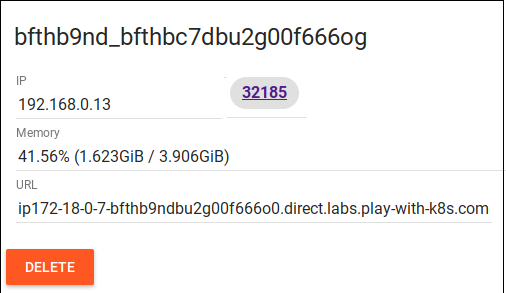
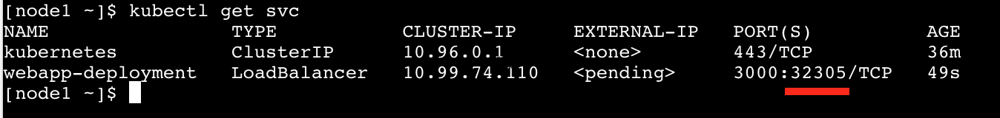
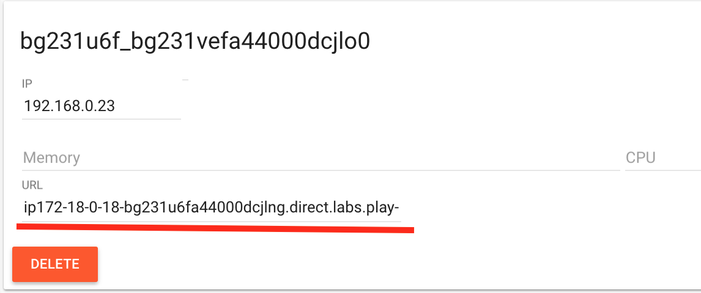

# Securing our pods.

## Deploying our application
The first thing we will do in this lab is deploy our web application to our cluster using a Kubernetes deployment.  
We will do that by issuing the below command

Note we are creating the deployment.yaml and running it with a single command. It is the equivalent to running  
`kubectl create -f <filename>.yaml`  

```
cat <<EOF | kubectl apply -f -
apiVersion: apps/v1 # for versions before 1.9.0 use apps/v1beta2
kind: Deployment
metadata:
  name: webapp-deployment
spec:
  selector:
    matchLabels:
      app: webapp
  replicas: 1
  template:
    metadata:
      labels:
        app: webapp
    spec:
      containers:
      - name: webapp
        image: scottyc/webapp:latest
        ports:
        - containerPort: 3000
          hostPort: 3000
EOF
```       
Then we expose the deployment   
`kubectl expose deployment webapp-deployment --type=LoadBalancer`  
### play with k8s
We should have a button pop up that will allow us to click through to our application.  
In the image below you can see mine has exposed `32185`  


NOTE: Current version of PWK has disabled the button feature. If you can't see it you can do the following:
`kubectl get services` and copy the exposed port for your service.



Don't worry the LoadBalancer EXTERNAL-IP is `<pending>` we don't use any external load balancer so we won't have any IP there. 

Now copy the URL provided on the top of the page:



The service should then be exposed at the `URL:PORT` combination.

e.g. `http://ip172-18-0-18-bg231u6fa44000dcjlng.direct.labs.play-with-k8s.com:32107`

### Minikube
To find the nodes port on minikube we will issue the command `minikube service list`
```
|-------------|----------------------|-----------------------------|
|  NAMESPACE  |         NAME         |             URL             |
|-------------|----------------------|-----------------------------|
| default     | kubernetes           | No node port                |
| default     | webapp-deployment    | http://172.16.146.152:30687 |
| kube-system | kube-dns             | No node port                |
| kube-system | kubernetes-dashboard | No node port                |
|-------------|----------------------|-----------------------------|
```

For me I can access the app at `http://172.16.146.152:30687`

### Azure 
For Azure you can find the end point for the webapp with the following  
`kubectl get services`

## The hack
Now we have our application running, lets look at a few things.  
Firstly we will get our pod name `kubectl get pods` mine is `webapp-deployment-865fb4d7c-8c5sv`   
We will then exec into the running container  `kubectl exec -it webapp-deployment-865fb4d7c-8c5sv sh`  
The `cd static` and `vim index.html`  
replace the gif link in line 19 with `https://media.giphy.com/media/DBfYJqH5AokgM/giphy.gif`  

Now check your browser !!!

lastly run `whoami` in the terminal

Now lets exit out of the pod shell and delete our deployment `kubectl delete deployments.apps webapp-deployment`

## Lets protect our app
Now we are going to look at setting some pod security on our deployments which will control our pods.  
Pod security policy is set in your deployment yaml under 
```
spec: 
  containers:
    securityContext:
```  

Pod security policy restricts what user the application is run as inside the pod, if the pod has a read only filesystem and lastly  
but not least if you want to allow privilege escalation. By default the pod security context are not turned on. If you want to get a lot of  
bang for your buck on the security front, this is the place to start. 

### Change the user the application runs as

We will change our deployment.yaml this time to set the user to a random user 100. This will make sure that we dont have matching  
uid to the underlying host.

```
cat <<EOF | kubectl apply -f -
apiVersion: apps/v1 # for versions before 1.9.0 use apps/v1beta2
kind: Deployment
metadata:
  name: webapp-deployment
spec:
  selector:
    matchLabels:
      app: webapp
  replicas: 1
  template:
    metadata:
      labels:
        app: webapp
    spec:
      containers:
      - name: webapp
        image: scottyc/webapp:latest
        ports:
        - containerPort: 3000
          hostPort: 3000
        securityContext:
          runAsUser: 1000
EOF
```

Once the deployment has finished we should we will again exec into the container as we did above and run `whoami` agian.
What changed ?   
now lets run `su` and then `whoami`

Lets clean up again with `kubectl delete deployments.apps webapp-deployment`

### Read only file system

In the original hack we defaced the website as we could modify the `index.html` file. One easy way to fix this is to make the filesystem read only.  
Run the below deployment  
```
cat <<EOF | kubectl apply -f -
apiVersion: apps/v1 # for versions before 1.9.0 use apps/v1beta2
kind: Deployment
metadata:
  name: webapp-deployment
spec:
  selector:
    matchLabels:
      app: webapp
  replicas: 1
  template:
    metadata:
      labels:
        app: webapp
    spec:
      containers:
      - name: webapp
        image: scottyc/webapp:latest
        ports:
        - containerPort: 3000
          hostPort: 3000
        securityContext:
          readOnlyRootFilesystem: true
EOF
```
We will now try to modify the `index.html` file again as we did before. 
Could you modify it ?  
Now run `whoami` do you see the issue still?  
Lets clean up again with `kubectl delete deployments.apps webapp-deployment`

### Disable privilege escalation 

In my opinion you should have this setting on every deployment or pod. I cant think of a reason that your application would  
need to escalate privilege. 

Now lets deploy our application again 

```
cat <<EOF | kubectl apply -f -
apiVersion: apps/v1 # for versions before 1.9.0 use apps/v1beta2
kind: Deployment
metadata:
  name: webapp-deployment
spec:
  selector:
    matchLabels:
      app: webapp
  replicas: 1
  template:
    metadata:
      labels:
        app: webapp
    spec:
      containers:
      - name: webapp
        image: scottyc/webapp:latest
        ports:
        - containerPort: 3000
          hostPort: 3000
        securityContext:
          allowPrivilegeEscalation: false
EOF
```

We will exec into the pod again and run `whoami` 
What user are you?

Lets clean up again with `kubectl delete deployments.apps webapp-deployment`

### All of them together
As we have seen there is holes in our security profile using all these contexts individually.
What if we add all three together in the one deployment.

Lets deploy our deployment again with the below example.

```
cat <<EOF | kubectl apply -f -
apiVersion: apps/v1 # for versions before 1.9.0 use apps/v1beta2
kind: Deployment
metadata:
  name: webapp-deployment
spec:
  selector:
    matchLabels:
      app: webapp
  replicas: 1
  template:
    metadata:
      labels:
        app: webapp
    spec:
      containers:
      - name: webapp
        image: scottyc/webapp:latest
        ports:
        - containerPort: 3000
          hostPort: 3000
        securityContext:
          runAsUser: 1000
          readOnlyRootFilesystem: true
          allowPrivilegeEscalation: false
EOF
```

Once the deployment has completed exec into the pod and see what user you are.  
Try to modify the `index.html` file.  
Then lastly `su` to see if you can get root access.
What did you find?
