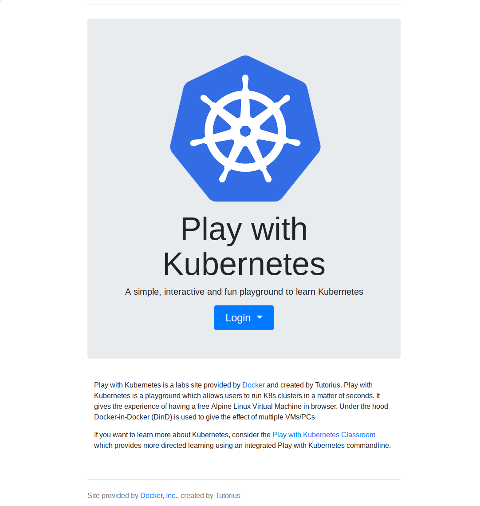
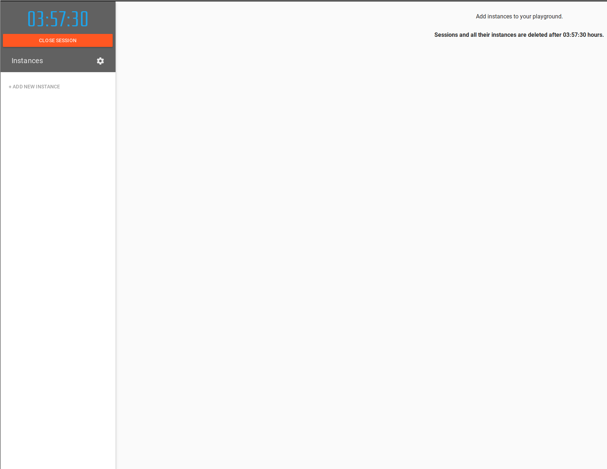
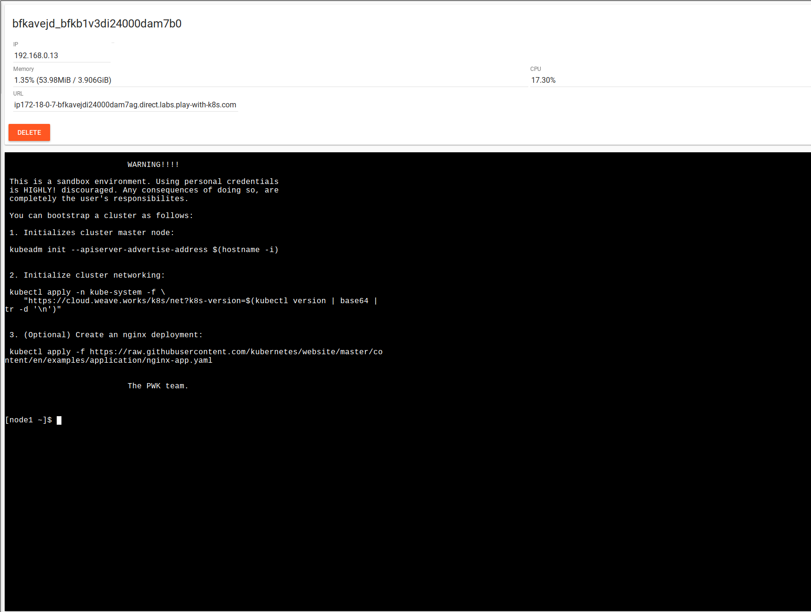
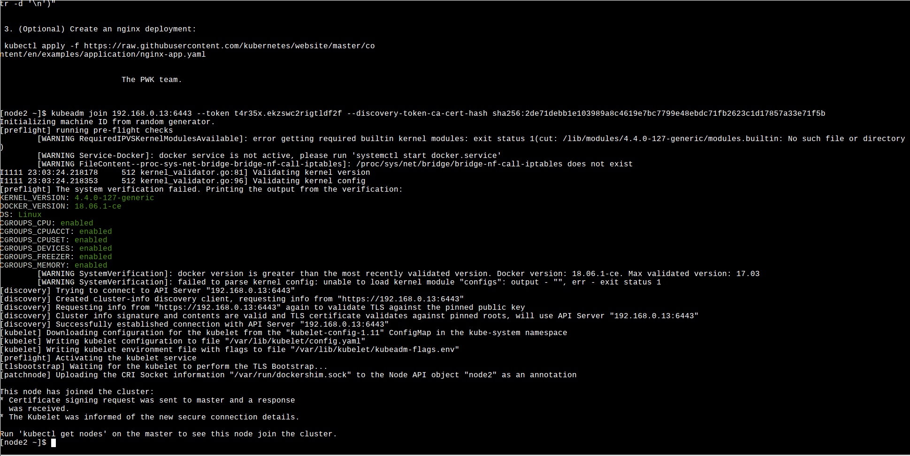
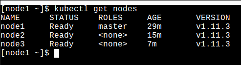
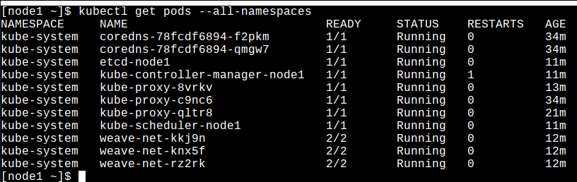

# Play with Kubernetes

To use the workshop with play with Kubernetes, firstly go to the website https://dockr.ly/scott   
You will be greeted with a login page  
  
You will need to login with you DockerHub or GitHub account.   
If you do not have a DockerHub account please use the following [documentation](https://docs.docker.com/docker-id/) to create an id.  
Once you are logged in hit the start button and you will be able to create your first instance.  

Now we are logged in you should see a screen like the below picture.  
  

To create a instance press the `add new instance` button on the top left corner. This will open a terminal for you.  
  

Run the following commands in the terminal  
`kubeadm init --apiserver-advertise-address $(hostname -i)` to initalize the controller.

```
kubectl apply -n kube-system -f \
    "https://cloud.weave.works/k8s/net?k8s-version=$(kubectl version | base64 |tr -d '\n')"
```
to install the weave network provider.  

You will get an output from the terminal like the following `kubeadm join 192.168.0.13:6443 --token t4r35x.ekzswc2rigtldf2f --discovery-token-ca-cert-hash sha256:2de71debb1e103989a8c4619e7bc7799e48ebdc71fb2623c1d17857a33e71f5b`  
This is used to join worker nodes to the cluster. PLEASE NOTE !!!! Do not copy and paste the join token above it will not work on your cluster. Use the join token outputed on your terminal.  


To join a worker node we will use the `add new instance` button again. This will create another instance. Then in the terminal we will enter the join command.  
`kubeadm join 192.168.0.13:6443 --token t4r35x.ekzswc2rigtldf2f --discovery-token-ca-cert-hash sha256:2de71debb1e103989a8c4619e7bc7799e48ebdc71fb2623c1d17857a33e71f5b` (NOTE PLEASE DO NOT COPY AND PASTE THIS LINE. USE YOUR JOIN TOKEN)  

You will get the following output if you were successful 
  
Now repeat the above steps once more so we have a cluster made up of a single controller and two worker nodes.  


Now changing back to the controller by pressing the `node 1` button on the left hand side. We will issue the following command in the terminal.  
`kubectl get nodes`  
  
You should see all nodes are in a ready state.  

We will then just check the status of our running pods.To do that we will issue the following command.  
`kubectl get pods --all-namespaces`  
  

All our pods should be running with nothing pending or in crashloop.

Last step lets install tmux as we will need that later
`yum install tmux vim openssl -y`

Now your setup is all complete.
